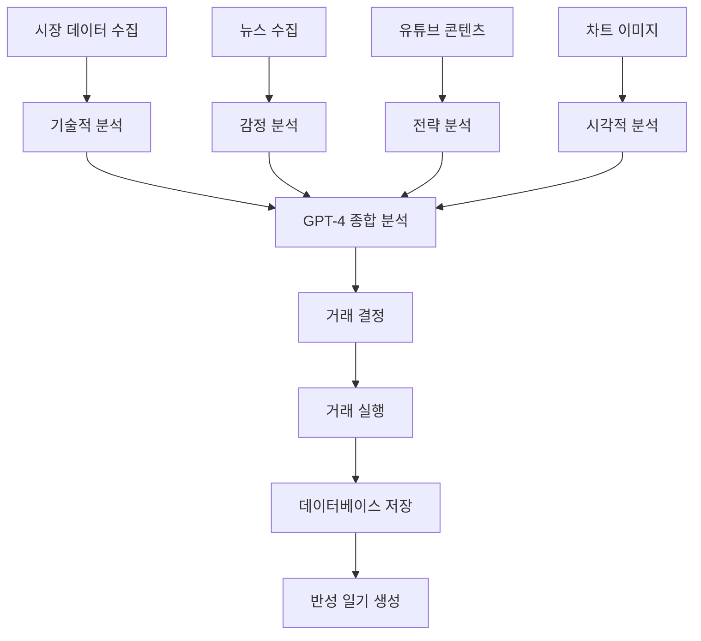

# GPT 비트코인 자동 거래 시스템

## 📋 프로젝트 개요

이 프로젝트는 **AI 기반 비트코인 자동 거래 시스템**으로, GPT-4를 활용하여 다양한 데이터 소스를 종합 분석하고 지능적인 투자 결정을 내리는 현대적인 암호화폐 거래 봇입니다.

## 🎯 프로젝트 목적

- **GPT-4 기반 AI 분석**: 텍스트 및 이미지 분석을 통한 종합적 투자 판단
- **자동화된 거래 실행**: 업비트 API를 통한 실시간 자동 거래
- **지속적 학습 시스템**: 거래 기록 및 반성 일기를 통한 성과 개선
- **실시간 모니터링**: Streamlit 대시보드를 통한 거래 현황 추적
- **멀티 아키텍처 지원**: ARM64(Apple Silicon) 및 x86_64 환경 지원

## 🏗️ 시스템 아키텍처

### 멀티 아키텍처 지원

이 프로젝트는 다양한 환경에서 실행할 수 있도록 설계되었습니다:

| 환경 | 아키텍처 | Dockerfile | docker-compose |
|------|----------|------------|----------------|
| **개발 환경** | ARM64 (Apple Silicon) | `Dockerfile.arm64` | `docker-compose.arm64.yml` |
| **운영 환경** | x86_64 (Linux/Windows) | `Dockerfile.x86_64` | `docker-compose.x86_64.yml` |

### 자동 플랫폼 감지

```bash
# 플랫폼을 자동으로 감지하여 적절한 설정으로 실행
./detect_platform.sh
```

## 📁 파일 구조

```
gpt-bitcoin-book-main/
├── autotrade.py              # 메인 거래 시스템
├── streamlit-app.py          # 모니터링 대시보드
├── strategy.txt              # 투자 전략 문서
├── requirements.txt          # 의존성 패키지
├── detect_platform.sh        # 플랫폼 감지 스크립트
├── Dockerfile               # 기본 Docker 이미지 빌드
├── Dockerfile.arm64         # ARM64용 Docker 이미지
├── Dockerfile.x86_64        # x86_64용 Docker 이미지
├── docker-compose.yml       # 기본 Docker Compose 설정
├── docker-compose.arm64.yml # ARM64용 Docker Compose
├── docker-compose.x86_64.yml # x86_64용 Docker Compose
├── docker-compose.prod.yml  # 프로덕션 환경 설정
├── .dockerignore            # Docker 빌드 제외 파일
├── nginx.conf               # Nginx 리버스 프록시 설정
├── init-db.sql              # PostgreSQL 초기화 스크립트
└── README.md                # 프로젝트 문서
```

## 🏗️ 시스템 아키텍처

### 핵심 클래스 구조

```python
class EnhancedCryptoTrader:
    ├── TradeManager          # 거래 실행 관리
    ├── DatabaseManager       # SQLite 데이터베이스 관리
    ├── OpenAI Client        # GPT-4 API 연동
    └── 외부 API 연동        # 공포탐욕지수, 뉴스, 유튜브
```

### 데이터 흐름



## 🛠️ 기술 스택

| 분류 | 기술 | 용도 |
|------|------|------|
| **AI/ML** | OpenAI GPT-4 | 텍스트 분석, 이미지 분석, 의사결정 |
| **거래소 API** | 업비트 (pyupbit) | 실시간 거래 실행 |
| **기술적 분석** | TA-Lib | RSI, MACD, 볼린저 밴드 등 |
| **웹 스크래핑** | Selenium | 차트 이미지 캡처 |
| **데이터 시각화** | Plotly, Streamlit | 대시보드 및 차트 |
| **데이터베이스** | SQLite/PostgreSQL | 거래 기록, 반성 일기 |
| **외부 API** | 공포탐욕지수, 뉴스 API | 시장 감정 분석 |
| **컨테이너** | Docker, Docker Compose | 배포 및 관리 |

## 📦 설치 및 설정

### 방법 1: Docker Compose 사용 (권장)

#### 1. 환경 변수 설정

`env.example` 파일을 `.env`로 복사하고 실제 API 키들을 입력하세요:

```bash
# 환경 변수 파일 복사
cp env.example .env

# .env 파일 편집
nano .env  # 또는 원하는 텍스트 에디터 사용
```

```env
# 업비트 API 키
UPBIT_ACCESS_KEY=your_access_key
UPBIT_SECRET_KEY=your_secret_key

# OpenAI API 키
OPENAI_API_KEY=

# SerpAPI 키 (뉴스 수집용)
SERPAPI_KEY=your_serpapi_key

# 데이터베이스 비밀번호 (선택사항)
DB_PASSWORD=your_db_password

# 헤드리스 모드 (서버 환경)
HEADLESS=true

# 추가 설정 (선택사항)
LOG_LEVEL=INFO
TRADING_TICKER=KRW-BTC
GPT_MODEL=gpt-4o-mini
CONFIDENCE_THRESHOLD=70
```

#### 2. 개발 환경 실행

```bash
# 기본 서비스 실행 (거래 봇 + 대시보드)
docker-compose up -d

# 모든 서비스 실행 (데이터베이스, Redis, Nginx 포함)
docker-compose --profile optional up -d

# 로그 확인
docker-compose logs -f trading-bot
docker-compose logs -f dashboard
```

#### 3. 프로덕션 환경 실행

```bash
# 프로덕션 설정으로 실행
docker-compose -f docker-compose.yml -f docker-compose.prod.yml up -d

# 리소스 제한 확인
docker-compose -f docker-compose.yml -f docker-compose.prod.yml ps
```

#### 4. 서비스 관리

```bash
# 서비스 중지
docker-compose down

# 서비스 재시작
docker-compose restart

# 특정 서비스만 재시작
docker-compose restart trading-bot

# 볼륨 삭제 (데이터 초기화)
docker-compose down -v
```

### 방법 2: 로컬 설치

#### 1. 의존성 설치

```bash
pip install -r requirements.txt
```

#### 2. 환경 변수 설정

```bash
# 환경 변수 파일 복사
cp env.example .env

# .env 파일 편집하여 실제 API 키 입력
nano .env
```

**필수 API 키:**
- **업비트 API**: 거래 실행을 위해 필요
- **OpenAI API**: AI 분석을 위해 필요

**선택사항 API 키:**
- **SerpAPI**: 뉴스 수집을 위해 필요 (없어도 기본 기능은 동작)

#### 3. 실행

```bash
# 자동 거래 봇 실행
python autotrade.py

# 모니터링 대시보드 실행
streamlit run streamlit-app.py
```

## 🚀 사용 방법

### Docker Compose 서비스 구성

| 서비스 | 포트 | 설명 |
|--------|------|------|
| **trading-bot** | - | 자동 거래 봇 (백그라운드 실행) |
| **dashboard** | 8501 | Streamlit 모니터링 대시보드 |
| **db** | 5432 | PostgreSQL 데이터베이스 (선택사항) |
| **redis** | 6379 | Redis 캐시 (선택사항) |
| **nginx** | 80/443 | Nginx 리버스 프록시 (선택사항) |

### 접속 방법

- **대시보드**: http://localhost:8501
- **Nginx 프록시**: http://localhost (선택사항)
- **데이터베이스**: localhost:5432 (선택사항)

### 환경별 실행 명령어

#### 개발 환경
```bash
# 기본 서비스만 실행
docker-compose up -d

# 모든 서비스 실행
docker-compose --profile optional up -d

# Chrome 설치 오류 시 Chromium 사용
docker-compose -f docker-compose.alternative.yml up -d
```

#### 프로덕션 환경
```bash
# 프로덕션 설정으로 실행
docker-compose -f docker-compose.yml -f docker-compose.prod.yml up -d

# 리소스 모니터링
docker stats
```

#### 테스트 환경
```bash
# 테스트용 설정
docker-compose -f docker-compose.yml -f docker-compose.override.yml up -d
```

## 🔧 주요 기능

### 1. **종합적 시장 분석**
- **기술적 지표**: RSI, MACD, 볼린저 밴드, 이동평균선
- **시장 감정**: 공포탐욕지수 실시간 분석
- **뉴스 분석**: 실시간 암호화폐 뉴스 수집 및 분석
- **콘텐츠 분석**: 유튜브 영상 자막 분석
- **시각적 분석**: 차트 이미지 캡처 및 GPT-4 분석

### 2. **AI 기반 거래 결정**
```python
# 거래 결정 구조
{
    "decision": "buy/sell/hold",
    "percentage": 0-100,
    "confidence_score": 0-100,
    "reason": "상세한 결정 근거",
    "reflection_based_adjustments": {
        "risk_adjustment": "리스크 조정 사항",
        "strategy_improvement": "전략 개선점",
        "confidence_factors": ["신뢰도 요소들"]
    }
}
```

### 3. **리스크 관리 시스템**
- **자동 손절매**: 신뢰도 기반 거래 실행
- **분할 매수/매도**: 리스크 분산
- **과거 분석**: 거래 기록 기반 개선
- **반성 일기**: 지속적 학습 및 전략 개선

### 4. **실시간 모니터링**
- **현재 상태**: BTC 가격, 보유량, 잔고
- **거래 히스토리**: 매수/매도 기록 추적
- **성과 분석**: 수익률, 성공률 분석
- **반성 일기**: AI 기반 거래 분석 및 개선점

## 📊 데이터베이스 구조

### SQLite (기본)
```sql
-- 거래 기록 테이블
CREATE TABLE trading_history (
    id INTEGER PRIMARY KEY AUTOINCREMENT,
    timestamp DATETIME NOT NULL,
    decision TEXT NOT NULL,
    percentage REAL NOT NULL,
    reason TEXT NOT NULL,
    btc_balance REAL NOT NULL,
    krw_balance REAL NOT NULL,
    btc_avg_buy_price REAL NOT NULL,
    btc_krw_price REAL NOT NULL
);

-- 반성 일기 테이블
CREATE TABLE trading_reflection (
    id INTEGER PRIMARY KEY AUTOINCREMENT,
    trading_id INTEGER NOT NULL,
    reflection_date DATETIME NOT NULL,
    market_condition TEXT NOT NULL,
    decision_analysis TEXT NOT NULL,
    improvement_points TEXT NOT NULL,
    success_rate REAL NOT NULL,
    learning_points TEXT NOT NULL
);
```

### PostgreSQL (선택사항)
- 고급 분석 뷰 및 함수 제공
- 성능 최적화된 인덱스
- 트랜잭션 안정성

## ⚙️ 운영 방식

### 스케줄링
```python
# 하루 3회 자동 거래
schedule.every().day.at("09:00").do(run_trading)
schedule.every().day.at("15:00").do(run_trading)
schedule.every().day.at("21:00").do(run_trading)
```

### 환경 지원
- **로컬 환경**: 개발 및 테스트
- **Docker 환경**: 컨테이너화된 배포
- **EC2 환경**: 클라우드 서버 운영
- **헤드리스 모드**: 서버 환경 자동 실행

## 🎯 시스템 특징

### 1. **다중 데이터 소스 활용**
- 기술적 분석 데이터
- 실시간 뉴스 및 감정 분석
- 유튜브 콘텐츠 분석
- 차트 이미지 시각적 분석

### 2. **AI 기반 의사결정**
- GPT-4를 통한 종합적 분석
- 구조화된 JSON 응답
- 신뢰도 점수 기반 거래 실행

### 3. **지속적 학습 시스템**
- 거래 기록 데이터베이스 저장
- AI 기반 반성 일기 생성
- 과거 분석을 통한 전략 개선

### 4. **실시간 모니터링**
- Streamlit 대시보드
- 실시간 거래 현황 추적
- 성과 분석 및 시각화

### 5. **체계적 리스크 관리**
- 자동 손절매 로직
- 분할 매수/매도
- 공포탐욕지수 반영

### 6. **컨테이너화된 배포**
- Docker Compose를 통한 쉬운 배포
- 환경별 설정 분리
- 자동 재시작 및 헬스체크

## 🔍 모니터링 및 로그

### 로그 확인
```bash
# 실시간 로그 확인
docker-compose logs -f

# 특정 서비스 로그
docker-compose logs -f trading-bot
docker-compose logs -f dashboard

# 로그 파일 확인
tail -f logs/trading.log
```

### 헬스체크
```bash
# 서비스 상태 확인
docker-compose ps

# 헬스체크 엔드포인트
curl http://localhost:8501/_stcore/health
curl http://localhost/health
```

### 성능 모니터링
```bash
# 리소스 사용량 확인
docker stats

# 컨테이너 상세 정보
docker-compose exec trading-bot top
```

## 🔑 API 키 발급 방법

### 1. 업비트 API 키 발급
1. [업비트 개발자 센터](https://upbit.com/mypage/open_api_management) 접속
2. 로그인 후 "Open API 관리" 클릭
3. "Open API 사용하기" 버튼 클릭
4. API 키와 Secret 키를 발급받아 `.env` 파일에 입력

### 2. OpenAI API 키 발급
1. [OpenAI 개발자 센터](https://platform.openai.com/api-keys) 접속
2. 로그인 후 "Create new secret key" 클릭
3. API 키를 발급받아 `.env` 파일에 입력

### 3. SerpAPI 키 발급 (선택사항)
1. [SerpAPI](https://serpapi.com/) 사이트 접속
2. 회원가입 후 API 키 발급
3. `.env` 파일에 입력

## ⚠️ 주의사항

1. **투자 위험**: 암호화폐 투자는 높은 위험을 수반합니다
2. **API 키 보안**: 환경 변수를 통한 안전한 API 키 관리
3. **테스트 환경**: 실제 거래 전 충분한 테스트 필요
4. **자금 관리**: 투자 가능한 자금만 사용하세요
5. **Docker 보안**: 프로덕션 환경에서는 보안 설정 강화 필요
6. **API 키 관리**: `.env` 파일은 절대 Git에 커밋하지 마세요

## 🛠️ 문제 해결

### 일반적인 문제들

#### 1. 컨테이너 시작 실패
```bash
# 로그 확인
docker-compose logs trading-bot

# 환경 변수 확인
docker-compose config

# 컨테이너 재빌드
docker-compose build --no-cache

# Chrome 설치 오류 시 대체 방법 사용
docker-compose -f docker-compose.alternative.yml up -d
```

#### 2. 대시보드 접속 불가
```bash
# 포트 확인
docker-compose ps

# 네트워크 확인
docker network ls

# 컨테이너 재시작
docker-compose restart dashboard
```

#### 3. 데이터베이스 연결 오류
```bash
# 데이터베이스 상태 확인
docker-compose exec db psql -U trading_user -d trading_db

# 데이터베이스 재시작
docker-compose restart db
```

#### 4. Chrome/Chromium 관련 오류
```bash
# Chrome 설치 오류 시 Chromium 사용
docker-compose -f docker-compose.alternative.yml up -d

# Chrome 버전 확인
docker-compose exec trading-bot google-chrome --version

# Chromium 버전 확인
docker-compose exec trading-bot chromium --version

# ChromeDriver 경로 확인
docker-compose exec trading-bot which chromedriver
```

#### 5. 메모리 부족 오류
```bash
# 리소스 사용량 확인
docker stats

# 컨테이너 리소스 제한 확인
docker-compose -f docker-compose.yml -f docker-compose.prod.yml ps

# 메모리 제한 증가
# docker-compose.prod.yml 파일에서 memory 제한 수정
```

## 🤝 기여하기

1. Fork the Project
2. Create your Feature Branch (`git checkout -b feature/AmazingFeature`)
3. Commit your Changes (`git commit -m 'Add some AmazingFeature'`)
4. Push to the Branch (`git push origin feature/AmazingFeature`)
5. Open a Pull Request

## 📝 라이선스

이 프로젝트는 MIT 라이선스 하에 배포됩니다. 자세한 내용은 `LICENSE` 파일을 참조하세요.

## 📞 문의

프로젝트에 대한 문의사항이 있으시면 이슈를 생성해 주세요.

---

**⚠️ 면책 조항**: 이 프로젝트는 교육 및 연구 목적으로 제작되었습니다. 실제 투자에 사용할 경우 발생하는 손실에 대해 책임지지 않습니다. 투자는 본인의 판단과 책임 하에 진행하시기 바랍니다.
